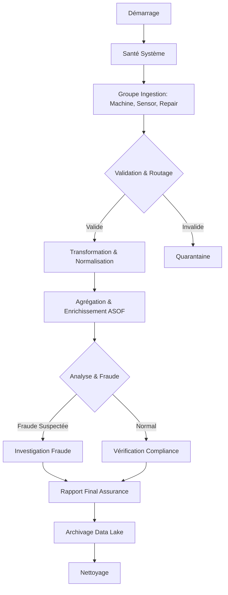

# automobile-airflow-pipeline
# Author : Kang DU
# Sophistication du Pipeline Airflow de Réparation Automobile

## 1. Vue d'ensemble

Ce projet implémente un pipeline de données **sophistiqué** et **robuste** pour le traitement automatisé des données de réparation automobile. Contrairement à un pipeline linéaire simple, ce système utilise des fonctionnalités avancées d'Apache Airflow pour gérer la complexité inhérente aux données IoT et aux processus d'assurance.

## 2. Caractéristiques de Sophistication

### 2.1. Architecture Modulaire et Découplée
Le pipeline ne se contente pas d'exécuter des scripts isolés. Il est structuré en **modules Python spécialisés** (`processors.py`, `validators.py`, `analytics.py`), ce qui permet :
*   **Testabilité**: Chaque module peut être testé unitairement.
*   **Réutilisabilité**: Les fonctions de transformation peuvent être utilisées par d'autres DAGs.
*   **Maintenance**: Les changements de logique métier n'impactent pas la structure du DAG.

### 2.2. Gestion Complexe du Flux de Travail (DAG)
Le DAG (`car_repair_pipeline_v2.py`) utilise plusieurs concepts avancés :
*   **TaskGroups**: Organisation logique des tâches (Ingestion, Validation, Fraude, Compliance) pour une meilleure lisibilité dans l'interface Airflow.
*   **BranchPythonOperator**: Prise de décision dynamique. Le pipeline choisit son chemin en fonction de la validité des données ou de la détection de fraude.
*   **TriggerRules**: Utilisation de `ONE_SUCCESS` et `ALL_SUCCESS` pour gérer les points de convergence complexes après des branchements.
*   **XComs**: Passage de métadonnées entre les tâches pour assurer la continuité du contexte (ex: chemins de fichiers, résultats de validation).

### 2.3. Validation et Qualité des Données (Data Quality)
Le pipeline intègre une validation à plusieurs niveaux :
*   **Validation de Schéma**: Vérification stricte des colonnes attendues pour chaque source.
*   **Validation de Contenu**: Détection de valeurs aberrantes ou manquantes avant le traitement.
*   **Quarantaine Automatique**: Les données invalides sont isolées sans interrompre le pipeline pour les données valides.

### 2.4. Analyses Avancées et Détection de Fraude
Le pipeline ne se limite pas à l'ETL (Extract, Transform, Load) ; il inclut une couche analytique :
*   **Jointure Temporelle (ASOF Join)**: Utilisation de techniques avancées pour joindre les réparations avec l'état de la machine au moment précis de l'incident.
*   **Détection d'Anomalies**: Algorithmes pour identifier les coûts de réparation suspects ou les comportements de capteurs anormaux.
*   **Analyse de Motifs (Pattern Analysis)**: Détection de fraudes potentielles basées sur la fréquence des réparations.

### 2.5. Préparation pour la Production
Le projet inclut tout le nécessaire pour un déploiement réel :
*   **Docker Compose**: Environnement conteneurisé complet (Webserver, Scheduler, Postgres).
*   **Gestion des Dépendances**: Fichier `requirements.txt` précis.
*   **Logging et Monitoring**: Utilisation intensive du logging Airflow pour la traçabilité.

## 3. Diagramme de Flux Logique

## 4. Conclusion

Ce pipeline représente une solution de niveau entreprise, capable de transformer des données brutes et désordonnées en informations exploitables et vérifiées pour le secteur de l'assurance automobile. Sa conception permet une évolution facile vers des modèles de Machine Learning plus complexes ou l'intégration de nouvelles sources de données.
