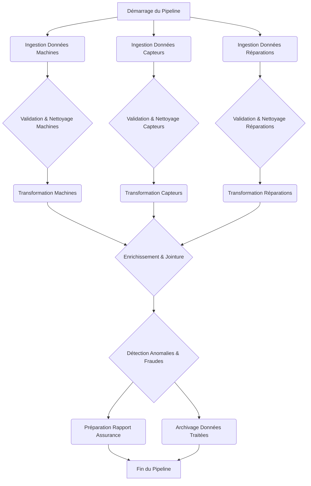

# Conception de l'architecture du pipeline et des données

## 1. Introduction

Ce document décrit l'architecture proposée pour un pipeline Airflow destiné au traitement automatisé des données de réparation automobile. L'objectif principal est de transformer des données brutes provenant de diverses sources (machines, capteurs, rapports de réparation) en informations structurées et validées, prêtes à être utilisées pour l'évaluation des demandes d'indemnisation d'assurance.

Le pipeline sera conçu pour être robuste, évolutif et capable de gérer des flux de données complexes, en intégrant des étapes de validation, de transformation, d'enrichissement et de détection d'anomalies.

## 2. Sources de Données et Structure

Nous allons simuler trois sources de données principales, chacune avec sa propre structure. Ces données seront initialement sous forme de fichiers CSV ou JSON pour simuler des exports de systèmes hétérogènes.

### 2.1. Données de Machines (Machine Data)

Ces données proviennent des systèmes embarqués des véhicules ou des équipements de diagnostic. Elles contiennent des informations sur l'état général du véhicule avant et après la réparation.

| Champ           | Type de Donnée | Description                                                |
| :-------------- | :------------- | :--------------------------------------------------------- |
| `machine_id`    | String         | Identifiant unique de la machine/véhicule                  |
| `timestamp`     | Datetime       | Horodatage de l'enregistrement des données                 |
| `odometer_km`   | Integer        | Kilométrage du véhicule                                    |
| `engine_status` | String         | État du moteur (ex: 'OK', 'Warning', 'Critical')           |
| `battery_volt`  | Float          | Tension de la batterie                                     |
| `fuel_level`    | Float          | Niveau de carburant en pourcentage                         |
| `error_codes`   | Array<String>  | Codes d'erreur détectés par le système (peut être vide)    |
| `gps_latitude`  | Float          | Latitude GPS du véhicule au moment de l'enregistrement     |
| `gps_longitude` | Float          | Longitude GPS du véhicule au moment de l'enregistrement    |

Exemple de données (JSON):
```json
{
  "machine_id": "VEH001",
  "timestamp": "2023-03-10T10:00:00Z",
  "odometer_km": 125000,
  "engine_status": "OK",
  "battery_volt": 12.5,
  "fuel_level": 75.2,
  "error_codes": [],
  "gps_latitude": 48.8566,
  "gps_longitude": 2.3522
}
```

### 2.2. Données de Capteurs (Sensor Data)

Ces données sont plus granulaires et proviennent de capteurs spécifiques, potentiellement liés à des composants critiques du véhicule. Elles peuvent indiquer des anomalies ou des usures.

| Champ           | Type de Donnée | Description                                                |
| :-------------- | :------------- | :--------------------------------------------------------- |
| `sensor_id`     | String         | Identifiant unique du capteur                              |
| `machine_id`    | String         | Identifiant unique de la machine/véhicule associée         |
| `timestamp`     | Datetime       | Horodatage de l'enregistrement des données                 |
| `sensor_type`   | String         | Type de capteur (ex: 'tire_pressure', 'brake_temp', 'oil_pressure') |
| `value`         | Float          | Valeur mesurée par le capteur                              |
| `unit`          | String         | Unité de mesure (ex: 'PSI', '°C', 'kPa')                   |
| `threshold_min` | Float          | Seuil minimal acceptable pour la valeur du capteur         |
| `threshold_max` | Float          | Seuil maximal acceptable pour la valeur du capteur         |

Exemple de données (JSON):
```json
{
  "sensor_id": "SEN005",
  "machine_id": "VEH001",
  "timestamp": "2023-03-10T10:05:00Z",
  "sensor_type": "tire_pressure",
  "value": 32.5,
  "unit": "PSI",
  "threshold_min": 30.0,
  "threshold_max": 35.0
}
```

### 2.3. Données de Réparation (Repair Data)

Ces données proviennent des ateliers de réparation et décrivent les interventions effectuées sur le véhicule.

| Champ             | Type de Donnée | Description                                                |
| :---------------- | :------------- | :--------------------------------------------------------- |
| `repair_id`       | String         | Identifiant unique de la réparation                        |
| `machine_id`      | String         | Identifiant unique de la machine/véhicule réparée          |
| `repair_date`     | Date           | Date de la réparation                                      |
| `repair_shop_id`  | String         | Identifiant de l'atelier de réparation                     |
| `description`     | String         | Description textuelle de la réparation effectuée           |
| `parts_cost`      | Float          | Coût des pièces de rechange                                |
| `labor_cost`      | Float          | Coût de la main-d'œuvre                                    |
| `total_cost`      | Float          | Coût total de la réparation (`parts_cost` + `labor_cost`) |
| `repaired_parts`  | Array<String>  | Liste des pièces réparées ou remplacées                    |
| `warranty_status` | Boolean        | Indique si la réparation est sous garantie                 |

Exemple de données (JSON):
```json
{
  "repair_id": "REP010",
  "machine_id": "VEH001",
  "repair_date": "2023-03-15",
  "repair_shop_id": "SHOP001",
  "description": "Remplacement des plaquettes de frein avant et disque",
  "parts_cost": 150.75,
  "labor_cost": 80.00,
  "total_cost": 230.75,
  "repaired_parts": ["front_brake_pads", "front_brake_discs"],
  "warranty_status": false
}
```

## 3. Architecture Conceptuelle du Pipeline Airflow

Le pipeline Airflow sera structuré en plusieurs étapes clés, chacune gérée par des tâches spécifiques au sein du DAG. L'objectif est de créer un flux de données logique et résilient.

### 3.1. Vue d'ensemble du DAG

Le DAG principal orchestrera l'ensemble du processus, depuis l'ingestion des données brutes jusqu'à la préparation des données pour l'analyse d'assurance. Il sera composé de sous-DAGs ou de groupes de tâches pour améliorer la lisibilité et la modularité.

### 3.2. Phases du Pipeline

1.  **Ingestion des Données Brutes (Raw Data Ingestion)**:
    *   Chargement des fichiers CSV/JSON depuis un emplacement de stockage (simulé ici comme un répertoire local).
    *   Validation sommaire du format des fichiers.
    *   Stockage des données brutes dans une zone de staging.

2.  **Validation et Nettoyage (Validation & Cleaning)**:
    *   **Validation de Schéma**: Vérification que les données respectent les schémas définis pour chaque type de source.
    *   **Validation de Contenu**: Vérification des plages de valeurs, des types de données, de la complétude (champs obligatoires).
    *   **Nettoyage**: Correction des erreurs simples (ex: format de date), suppression des doublons, gestion des valeurs manquantes.
    *   **Quarantaine**: Isolation des enregistrements invalides pour une revue manuelle ou un traitement ultérieur.

3.  **Transformation et Normalisation (Transformation & Normalization)**:
    *   **Normalisation des Unités**: Conversion des unités de mesure (ex: PSI en Bar, km en miles si nécessaire).
    *   **Standardisation des Catégories**: Unification des termes pour les types de capteurs, statuts moteur, etc.
    *   **Calcul de Champs Dérivés**: Calcul de l'âge du véhicule, de la fréquence des réparations, etc.
    *   **Agrégation**: Agrégation de données de capteurs sur des périodes spécifiques.

4.  **Enrichissement des Données (Data Enrichment)**:
    *   **Jointure**: Combinaison des données de machines, capteurs et réparations en utilisant `machine_id` et `timestamp`/`repair_date`.
    *   **Données Externes**: Simulation d'un enrichissement avec des données externes (ex: informations sur le modèle de véhicule, historique des rappels, données météorologiques au moment de l'incident).
    *   **Géocodage Inversé**: Conversion des coordonnées GPS en adresses ou régions (si pertinent).

5.  **Détection d'Anomalies et de Fraudes Potentielles (Anomaly & Fraud Detection)**:
    *   **Règles Métier**: Application de règles métier pour identifier des réparations suspectes (ex: coût élevé pour un faible kilométrage, réparations fréquentes sur la même pièce).
    *   **Analyse Statistique**: Détection de valeurs aberrantes dans les données de capteurs ou les coûts de réparation.
    *   **Corrélation**: Identification de corrélations inattendues entre les données de capteurs et les réparations.

6.  **Préparation pour l'Analyse d'Assurance (Insurance Claim Preparation)**:
    *   **Structuration Finale**: Organisation des données dans un format optimisé pour les systèmes d'analyse d'assurance (ex: tableau plat, format Parquet).
    *   **Génération de Rapports**: Création de rapports sommaires ou d'alertes pour les analystes d'assurance.
    *   **Archivage**: Stockage des données traitées dans un entrepôt de données (Data Warehouse) ou un lac de données (Data Lake).

## 4. Technologies et Outils

*   **Orchestration**: Apache Airflow
*   **Langage**: Python 3.x
*   **Conteneurisation**: Docker, Docker Compose
*   **Stockage (simulé)**: Système de fichiers local pour les données brutes et traitées
*   **Bibliothèques Python**: Pandas pour la manipulation de données, scikit-learn pour la détection d'anomalies (si implémenté), etc.

## 5. Flux de Travail Détaillé du DAG

Le DAG sera conçu pour permettre des dépendances complexes et des exécutions parallèles là où c'est possible. Par exemple, l'ingestion des trois types de données peut se faire en parallèle, mais la validation de chaque type doit précéder sa transformation.

Une attention particulière sera portée à la gestion des erreurs et à la re-tentative des tâches.



Ce diagramme Mermaid représente une vue simplifiée. Le DAG réel inclura des tâches plus granulaires, des branchements conditionnels et des mécanismes de gestion d'erreurs.

## 6. Conclusion

Cette architecture fournit une base solide pour le développement du pipeline Airflow. Les prochaines étapes consisteront à générer les données simulées, puis à implémenter les tâches Airflow et les scripts Python correspondants.
